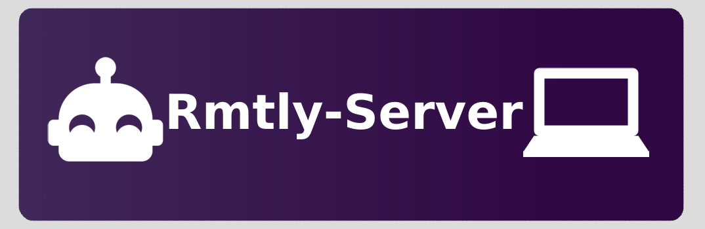

# Rmtly-Server


<p align="center">Server for remote control your pc 💻</p>

<p align="center">
    <a href="https://github.com/free-bots/rmtly-server/releases" alt="GitHub release (latest by date)">
        </a>
    <a href="https://github.com/free-bots/rmtly-server/blob/master/LICENSE.md" alt="License">
        </a>
    <a href="https://github.com/free-bots/rmtly-server/graphs/contributors" alt="Contributors">
        </a>
</p>

# Table of Contents

- [Rmtly-Server](#rmtly-server)
- [Table of Contents](#table-of-contents)
  - [Features](#features)
  - [Requirements](#requirements)
    - [Ubuntu](#ubuntu)
    - [Arch Linux](#arch-linux)
  - [Build](#build)
  - [Run](#run)
  - [Contribution](#contribution)
  - [About](#about)
  - [API](#api)
    - [Get all applications](#get-all-applications)
    - [Get single application](#get-single-application)
    - [Run an application](#run-an-application)
    - [Get icon of an application](#get-icon-of-an-application)
    - [SignUp a device](#signup-a-device)
    - [Configuration](#configuration)
      - [Default Config](#default-config)
  - [Mobile App](#mobile-app)
  - [License](#license)

## Features

- List all installed applications of your pc
- List all application categories of your pc
- Start applications with or without delay

## Requirements
### Ubuntu
```
sudo apt install libgtk-3-dev libcairo2-dev libglib2.0-dev libnotify-bin 
```
### Arch Linux
```
sudo pacman -S gtk3 libnotify
```

## Build
Run `make` or `make build` and at `<project directory>/bin` the binary called rmtly-server can be used.

## Run
After building the project run `make run` or open the rmtly-server file in the build directory.

## Contribution

If you miss an important feature fell free to contribute or create a feature request.

## About
rmtly-server is a server application written in golang that allows you to start application with a rest api

## API
### Get all applications
```
http://localhost:3000/applications
```
### Get single application
```
http://localhost:3000/applications/org.gnome.gedit.desktop
```
### Run an application
```
http://localhost:3000/applications/run/org.gnome.gedit.desktop
```
### Get icon of an application
```
http://localhost:3000/applications/org.gnome.gedit.desktop/icon
```
### SignUp a device
```
http://localhost:3000/authentication/code
```
after requesting the code go to the terminal and scan the created qr code or type it then post a json with that code and an id 
```json
{
  "qrCode": "code",
  "deviceId": "random string"
}
```
to `http://localhost:3000/authentication/signUp` 
after that you get a jwt and add it to your headers for the requests

### Configuration
The config file for this server is located at `.config/rmtly-server/config.json` this file is auto generated if not available.

#### Default Config
```
{
  "application": { "cacheExpiresInMillis": 10000 },
  "security": {
    "expirationInDays": 99, // jwt expiration time
    "secret": "authenticationCode",
  },
  "network": { "address": "0.0.0.0:3000" }
}
```

## Mobile App
Check out [Rmtly](https://github.com/free-bots/rmtly) to control your pc with your phone.


## License
> MIT License

> Copyright (c) 2021 free-bots

> Permission is hereby granted, free of charge, to any person obtaining a copy
of this software and associated documentation files (the "Software"), to deal
in the Software without restriction, including without limitation the rights
to use, copy, modify, merge, publish, distribute, sublicense, and/or sell
copies of the Software, and to permit persons to whom the Software is
furnished to do so, subject to the following conditions:

> The above copyright notice and this permission notice shall be included in all
copies or substantial portions of the Software.

> THE SOFTWARE IS PROVIDED "AS IS", WITHOUT WARRANTY OF ANY KIND, EXPRESS OR
IMPLIED, INCLUDING BUT NOT LIMITED TO THE WARRANTIES OF MERCHANTABILITY,
FITNESS FOR A PARTICULAR PURPOSE AND NONINFRINGEMENT. IN NO EVENT SHALL THE
AUTHORS OR COPYRIGHT HOLDERS BE LIABLE FOR ANY CLAIM, DAMAGES OR OTHER
LIABILITY, WHETHER IN AN ACTION OF CONTRACT, TORT OR OTHERWISE, ARISING FROM,
OUT OF OR IN CONNECTION WITH THE SOFTWARE OR THE USE OR OTHER DEALINGS IN THE
SOFTWARE.
